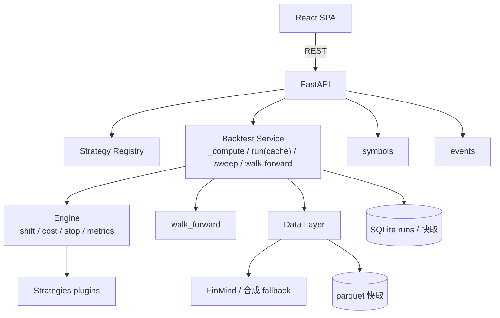

# Architecture

## 總覽

```
Browser (localhost:5173)
  |  React + Vite + Tailwind v4 + shadcn 風格 + lightweight-charts
  v  REST / JSON (localhost:8000)
FastAPI
  +--> Strategy Registry      (plugin 自動註冊)
  +--> Backtest Service       (_compute 核心 + run 快取包裝 + sweep + walk-forward)
  +--> Engine                 (signal+shift / cost / stop / split / metrics / walk_forward)
  +--> Data Layer             (FinMind → parquet 快取 → 合成 fallback)
  +--> Persistence            (SQLite:runs + input_hash 快取)
  +--> Symbols / Events       (標的規格表 / 大型事件策展)
```



## 回測資料流

```
選標的 + 策略 + 參數 + Run
  → 前端 POST /backtest {strategy, params, symbol, start, end, cost, is_ratio, split_mode?, wf_*?}
  → run():make_hash → 命中快取則秒回;否則 _compute()
       _compute:取資料(快取/FinMind/合成)→ strategy.generate() → 引擎 run_backtest()
                → compute_metrics() → (可選)walk_forward → 組回應 → store.save()
  → 前端:KPI + 勝率分析 + 線圖(+事件標記)+ 交易表 渲染;成功後抓 /events 疊標記
```

## 正確性保證(集中在引擎)

```
策略 plugin 只產 entries/exits(純函數,禁未來資料/IO/隨機)
   |
引擎統一處理(策略不碰):
   +--> entries.shift(1)        執行於次根,防未來函數(look-ahead)
   +--> 成本(手續費+稅+滑價)    換手日扣
   +--> 停損(sl_stop)          引擎套用
   +--> 五組指標 + 勝率分析      compute_metrics
```

## 模組職責

| 模組 | 職責 |
|------|------|
| `service.py` | 編排:`_compute`(無快取核心)/ `run`(快取)/ `resolve_params` |
| `engine/backtest.py` | 事件式回測(shift/cost/stop)→ equity/trades/position |
| `engine/metrics.py` | 五組指標(報酬/風險/風險調整/交易品質+勝率/對照)+ 警示旗標 |
| `engine/split.py` | Hold-Out 切點 + walk-forward 視窗產生器 |
| `engine/walk_forward.py` | 每段樣本內最佳化 → OOS 驗證 → 拼接;WFE / OOS Decay |
| `data/loader.py` | FinMind(期貨/股票分流)→ parquet 快取 → 合成 fallback |
| `store.py` | SQLite:runs 持久化 + input_hash 快取 |
| `symbols.py` / `events.py` | 標的規格表 / 大型事件策展清單 |

## 前端結構

```
App.tsx(state + 接線)
  +--> SymbolSelector(標的)/ StrategyList / StrategyDetail / SweepPanel
  +--> MetricsPanel / WinRatePanel / Charts(權益+回撤,事件 markers)/ TradesTable
  +--> CompareView(pin 比較)/ HistoryPanel(/runs)
  +--> api/client.ts · types.ts(須與後端同步)· lib/utils.ts · components/ui/*
```

## 設計決策

- **純 pandas 引擎**(非 vectorbt):MVP 保證可跑、零 numba 安裝風險;對外契約(Signals→equity/trades/metrics)不變,可日後抽換。
- **標的切換 = 換資料源**:回測為報酬率(%)基礎,每點價值只影響絕對損益/口數,不影響 % 報酬。
- **快取鍵 input_hash**:含 strategy/params/symbol/區間/cost/split 全欄位 → 任一變動即新算。
