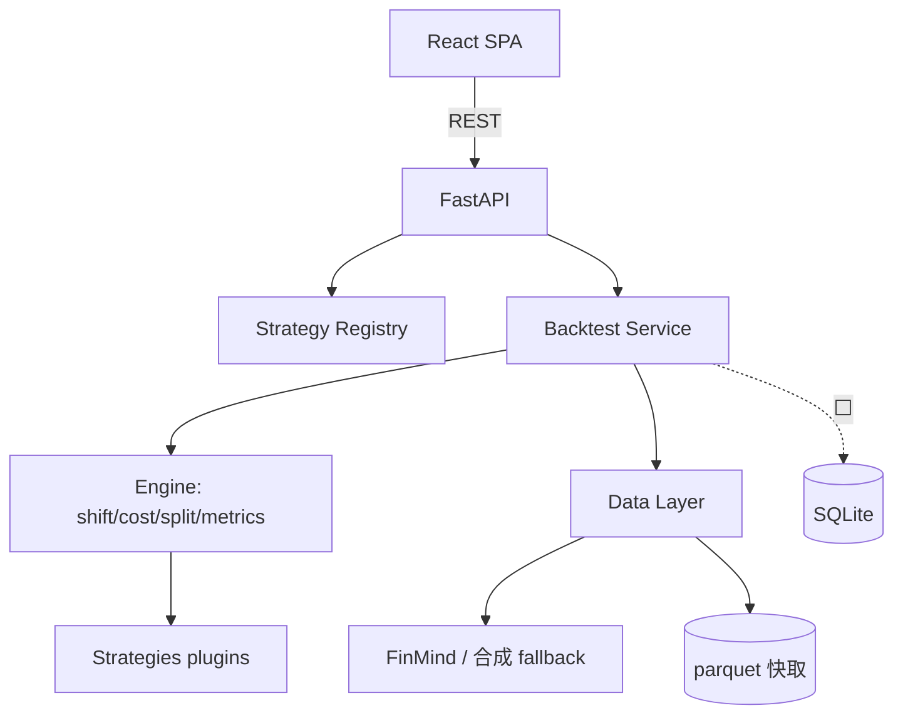

# Strategy Board — Planning Spec

> 版本 v0.1 · 2026-06-29 · 個人用台股/台指期策略回測工作台
> 狀態圖例:✅ 已實作 · 🟡 部分實作 · ⬜ 未實作

---

## 1. 產品定位 & Scope

**定位**:選策略 → 跑回測 → 看五組指標 + 勝率分析 + 線圖。本質是「回測結果的瀏覽與管理器」,不是下單系統。

```
In Scope (v1)
  +--> ✅ 策略清單(選擇、分類、搜尋)
  +--> ✅ 觸發回測(call 免費資料 API + 回測引擎)
  +--> ✅ 五組指標 + 勝率分析 + 權益/回撤/交易明細
  +--> ✅ Benchmark(Buy&Hold)對照
  +--> ✅ 參數調整(slider)+ 重跑
  +--> ✅ 樣本內/外切分(holdout 切點 + 權益曲線分段著色)
  +--> ✅ 結果快取(SQLite input_hash;同參數秒回)+ GET /runs 歷史
  +--> 🟡 walk-forward 視窗產生器已備,未串 UI
  +--> ⬜ 策略比較、參數掃描熱圖、runs 歷史 UI

Out of Scope (v1,明確排除)
  +--> 即時行情 / 真實下單
  +--> 多人 / 權限 / 帳號 / 雲端部署
```

**核心約束**:全棧零訂閱費(開源 + 免費資料)。

---

## 2. 設計風格(Design Language)

主題:**Quant Terminal × Modern Dashboard** — 暗色優先、數據密集、數字等寬、損益紅綠語意色。

**Design Tokens**(✅ `frontend/src/index.css`,shadcn 風格 CSS variables + Tailwind v4 `@theme inline`):

| Token | 暗色 | 用途 |
|-------|------|------|
| `--background` | `#0d1117` | 背景 |
| `--card` | `#161b22` | 卡片 |
| `--border` | `#30363d` | 分隔 |
| `--foreground` | `#e6edf3` | 主文字 |
| `--muted-foreground` | `#8b949e` | 次要 |
| `--primary` | `#2563eb` | 強調/選取 |
| `--profit` / `--loss` | `#26a69a` / `#ef5350` | 損益語意色 |

- 字體:介面 Inter;數字/表格等寬(JetBrains Mono)對齊小數點。
- 桌面優先;窄螢幕 sidebar 收抽屜、KPI tiles 5→2 欄(⬜)。

---

## 3. 功能規範(Functional)

| # | 功能 | 狀態 | 對應檔 |
|---|------|:---:|------|
| F1 | 策略清單(選取/分類/搜尋) | ✅ | `features/StrategyList.tsx` |
| F2 | 策略詳情 + 參數面板 | ✅ | `features/StrategyDetail.tsx` |
| F3 | 觸發回測 + 狀態(idle/running/done/error) | ✅ | `App.tsx` |
| F4 | 五組 KPI tiles | ✅ | `features/MetricsPanel.tsx` |
| F5 | 勝率分析 panel | ✅ | `features/WinRatePanel.tsx` |
| F6 | 權益/回撤線圖 + benchmark | ✅ | `features/Charts.tsx` |
| F7 | 交易明細表 | ✅ | `features/TradesTable.tsx` |
| F8 | 結果快取(同參數秒回) | ✅ | `backend/app/store.py`(SQLite input_hash) |
| F9 | 策略比較(並排 KPI/疊圖) | ✅ | `features/CompareView.tsx`(pin 模式) |
| F10 | 參數掃描(敏感度) | ✅ | `features/SweepPanel.tsx` + `backend/app/sweep.py` |
| F11 | 回測歷史 | ✅ | `features/HistoryPanel.tsx` + `GET /runs` |
| F12 | Walk-Forward 驗證 | ✅ | `engine/walk_forward.py`(WFE/OOS Decay/各段勝率) |
| F13 | 真實資料(FinMind 台指期) | ✅ | `data/loader.py`(Py3.14 需 lxml≥5 + --no-deps) |
| F14 | 交易標的選擇 | ✅ | `symbols.py` + `GET /symbols` + `SymbolSelector.tsx`(TX/MTX/TMF/0050/00631L/2330) |
| F15 | 大型事件標記 | ✅ | `events.py` + `GET /events` + `events.ts`(線圖 markers + 開關) |

---

## 4. 非功能規範(Non-functional)

```
+--> ✅ 正確性:訊號統一 shift(1) 防未來函數、成本內建、停損由引擎套
+--> ✅ 可重現:合成資料種子用 hashlib(非 Python hash(),後者 per-process 加鹽)
+--> ✅ 開箱即跑:資料三層 fallback,沒網路/沒裝 FinMind 也能跑
+--> ✅ 樣本不足警示:交易<30 或高勝率負期望 → UI 旗標
+--> ✅ 持久化:SQLite 存 run 結果 + input_hash 快取鍵(`store.py`)
+--> ⬜ 非同步長任務:run_id + 輪詢 status(目前同步回傳)
```

---

## 5. 技術架構

```
Browser (localhost:5173)
  |  React + Vite + Tailwind v4 + shadcn 風格 + lightweight-charts
  v  REST / JSON (localhost:8000)
FastAPI
  +--> Strategy Registry      (plugin 自動註冊)
  +--> Backtest Service       (取資料→引擎→指標→組回應)
  +--> Engine                 (signal+shift / cost / split / metrics)
  +--> Data Layer             (FinMind → parquet 快取 → 合成 fallback)
  +--> Persistence            (⬜ SQLite)
```



**棧定案**:React + Vite + Tailwind v4 + shadcn 風格 + lightweight-charts + FastAPI + pandas 引擎。
回測引擎 MVP 用純 pandas(保證可跑),production 抽換 vectorbt(對外契約不變)。

---

## 6. 資料流

```
選策略 + 設參數 + Run
  → 前端 POST /backtest {strategy, params, symbol, start, end, cost, is_ratio}
  → 後端:取資料(快取/FinMind/合成)→ strategy.generate() → 引擎 run_backtest()
          → compute_metrics() → 組回應(同步回傳)
  → 前端:KPI + 勝率分析 + 線圖 + 交易表 渲染
⬜ 長任務變體:先回 run_id,前端輪詢 GET /backtest/{run_id}/status
```

---

## 7. API 合約

### `GET /health` → `{status:"ok"}`

### `GET /strategies` → `StrategyInfo[]`
```ts
StrategyInfo {
  id: string; name: string;
  category: "trend"|"meanrev"|"intraday";
  description: string;
  params: { name; type:"int"|"float"; default; min; max; step; label }[]
}
```

### `POST /backtest` → `BacktestResponse`
Request:
```ts
{ strategy: string; params: Record<string,number>;
  symbol="TX"; start="2018-01-01"; end="2025-12-31";
  cost=0.0005; is_ratio=0.7 }
```
Response:
```ts
{ strategy; symbol; data_source:"cache"|"finmind"|"synthetic";
  is_split_index: number;          // 樣本內/外切點 index
  metrics: Metrics;                // 見 §8
  equity:    {time;value}[];       // 權益淨值(起點 1.0)
  benchmark: {time;value}[];       // Buy&Hold
  drawdown:  {time;value}[];
  trades:    Trade[] }             // 見 §8
```
錯誤:未知策略 → `404`;引擎錯 → `500 {detail}`。

⬜ 規劃中:`POST /compare`、`GET /data/availability`、`GET /backtest/{run_id}/status`。

---

## 8. 資料模型

**Metrics**(✅ `backend/app/engine/metrics.py`,五組):
```
組1 報酬   total_return, cagr
組2 風險   max_drawdown
組3 風調   sharpe, sortino, calmar
組4 交易   n_trades, win_rate, payoff, expectancy, profit_factor,
           avg_win, avg_loss, win_rate_long/short, n_long/short,
           max_consec_win/loss, win_rate_by_window, pnl_distribution
組5 對照   benchmark_cagr, alpha_vs_benchmark
旗標       warn_low_sample, warn_high_winrate_neg_exp
```

**Trade**:`{ entry_date, exit_date, entry_price, exit_price, pnl, bars, reason:"signal"|"stop"|"eod" }`

⬜ **持久化 schema**(SQLite):`strategies / runs(run_id, params_snapshot, input_hash) / results`。

---

## 9. Plugin 介面契約

✅ `backend/app/strategies/base.py`。新增策略 = 放一個 `.py` + `@register_strategy`,核心不動。

```python
class Strategy(ABC):
    name: str; category: str; description: str
    params: dict[str, Param]          # Board 自動生成 UI 控件
    def generate(self, df, p) -> Signals: ...   # 回 entries/exits(+可選 sl_stop)
```

**契約規則**:
```
必須                          禁止
+--> 繼承 Strategy            +--> 自行 shift 執行訊號(引擎統一做)
+--> 宣告 name/category/params +--> I/O / 查 DB / 打 API
+--> generate 回 Signals      +--> 使用未來資料(look-ahead)
+--> 輸出與 df 等長同 index    +--> 全域可變狀態 / 隨機(破壞可重現)
```

引擎消費:`entries.shift(1)` → 套成本 + 停損 → equity/trades/metrics(✅ `engine/backtest.py`)。
已內建:✅ MaCross(trend)、✅ RsiMeanRev(meanrev)。

---

## 10. Engine — Split / Walk-Forward

✅ `backend/app/engine/split.py`(holdout 切點 + walk-forward 視窗產生器)。

```
模式 A Hold-Out (✅ 預設):  [== IS 70% ==][== OOS 30% ==]
模式 B WF Rolling (🟡 產生器已備): 等寬視窗往前滑,test 段拼接
模式 C WF Anchored (🟡): train 起點固定、擴張
```

**Walk-Forward 演算法**(⬜ 串接):每視窗在 train 最佳化參數 → 在 test 驗證(沒看過)→ 拼接 OOS 權益。
**專屬指標**(⬜):WFE = OOS年化/IS年化(>0.5 可信)、OOS Decay(<30% 穩)、各視窗參數穩定度。

---

## 11. 勝率分析 Spec

✅ `features/WinRatePanel.tsx`。**核心紀律:勝率永遠與盈虧比、期望值同框,單看勝率會騙人。**

```
+--> 勝率 / 盈虧比 / 期望值 / 獲利因子 強制同列
+--> 多空分離勝率、最大連勝/連敗
+--> 警示:高勝率(>60%)+ 負期望 → 紅旗「小賺大賠勿信」
+--> 警示:交易<30 → 黃旗「無統計意義」
+--> 🟡 勝率穩定度(walk-forward 各段折線,holdout 模式為空)
+--> ✅ P&L 分布直方圖(紅綠分色,呈現賺賠形狀)
```

---

## 12. 資料源策略(零訂閱)

```
+--> 主力:FinMind 免費 tier(無需開戶;台股+台指期+籌碼;額度限制用 parquet 快取規避)
+--> 備援:期交所公開資料(免費但需清洗 + 連續合約接續)⬜
+--> 進階:Shioaji(永豐免費開戶、無訂閱、台股最划算)⬜
+--> 保險:✅ 合成資料 fallback(沒網路/沒裝 FinMind 也能跑)
```
⚠️ 台指期連續合約目前用「每日最大量合約」近似(✅),production 需正式 roll over(⬜)。
⚠️ 使用者機 Python 3.14,FinMind 可能裝不起 → 合成 fallback 為必要。

---

## 13. MVP 里程碑

```
M1 核心可用   ✅ 策略清單+選取+觸發回測+五組 KPI+權益曲線
M2 可信       ✅ benchmark+回撤圖+交易表+勝率分析+樣本不足警示+IS/OOS 分段著色+P&L 分布圖
M3 好用       ✅ 結果快取 + 策略比較 + 參數掃描 + runs 歷史 UI
M4 進階       🟡 walk-forward 串接 ✅(WFE/OOS Decay)· 真實資料 ✅ · 報告匯出 ⬜ · vectorbt 抽換 ⬜
              註:MVP 可用程度已達成(A+D+B 完成);C(vectorbt)為純效能優化,延後
```

---

## 14. 已知限制 / 技術債

```
+--> 引擎為純 pandas(正確但慢)→ 大資料/掃參數需抽換 vectorbt
+--> 回測同步阻塞 → 長任務需改 run_id + 輪詢
+--> 無持久化 → 每次重跑,結果不留存
+--> 台指期連續合約為近似 → 影響回測精度
+--> 只做多(空單欄位預留)→ 需支援放空策略
+--> 前端無狀態管理庫(plain useState)→ 規模長大後上 Zustand + TanStack Query
```

---

## 附錄:啟動

```bash
# 後端
cd backend && python3 -m venv .venv && source .venv/bin/activate
pip install -r requirements.txt
uvicorn app.main:app --reload --port 8000
# 前端
cd frontend && pnpm install && pnpm dev   # http://localhost:5173
```
